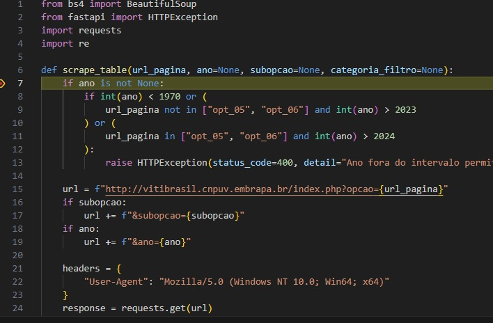
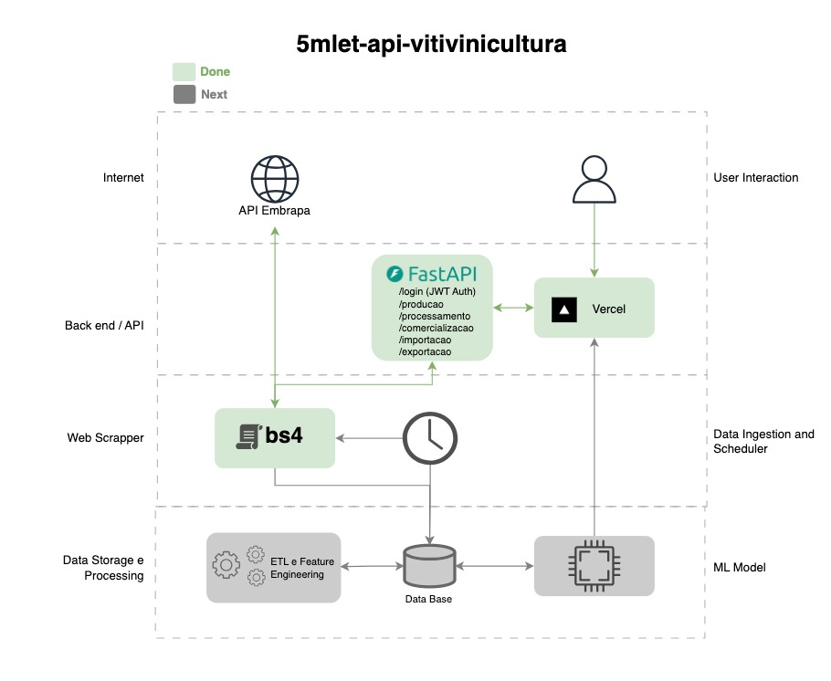

# 5mlet-api-vitivinicultura

**Vitivinicultura API – Embrapa** é uma API RESTful em Python que disponibiliza dados de vitivinicultura no Brasil extraídos do site http://vitibrasil.cnpuv.embrapa.br/. Fornece informações de produção, processamento, comercialização, importação, exportação.

---

## Funcionalidades

| Rota               | Método | Descrição                                                |
| ------------------ | ------ | -------------------------------------------------------- |
| `/login`           | POST   | Retorna um JWT para autenticar requisições subsequentes. |
| `/producao`        | GET    | Dados de produção de vinhos, sucos e derivados no RS.    |
| `/processamento`   | GET    | Quantidade de uvas processadas no RS.                    |
| `/comercializacao` | GET    | Dados de comercialização de vinhos e derivados no RS.    |
| `/importacao`      | GET    | Dados de importação de derivados de uva no Brasil.       |
| `/exportacao`      | GET    | Dados de exportação de derivados de uva no Brasil.       |
| `/abc_exportacao`  | GET    | Classificador ABC aplicado aos dados de exportação.      |

---

## Como utilizar o Classificador ABC aplicado aos dados de exportação

É obrigatório repassar o token na autenticação e em params preencher o parâmetro chamado dados exemplo:

```
valor: {    "dados":[
                    {"Países": "Haiti","Quantidade (Kg)": "559.645","Valor (US$)": "871.661"},
                    {"Países": "Paraguai","Quantidade (Kg)": "3.780.378","Valor (US$)": "5.517.263"}
                    ,{"Países": "Uruguai","Quantidade (Kg)": "326.093","Valor (US$)": "454.271"}
                    ]
        }
```

Onde o valor é o atributo dados é o retorno do endpoint /exportação, com isso carregamos os dados de exportação para a classificação da curva ABC. Agora é só submeter a requisição que retornará os dados classificados conforme o exemplo:

```
    [
        {
            'Países': 'Paraguai',
            'Quantidade (Kg)': '3.780.378',
            'Valor (US$)': '5.517.263',
            'classificação': 'A',
            'participação': '80.62%',
            'acumulado': '80.62%'
        },
        {
            'Países': 'Haiti',
            'Quantidade (Kg)': '559.645',
            'Valor (US$)': '871.661',
            'classificação': 'A',
            'participação': '12.74%',
            'acumulado': '93.36%'
        },
        {
            'Países': 'Uruguai',
            'Quantidade (Kg)': '326.093',
            'Valor (US$)': '454.271',
            'classificação': 'A',
            'participação': '6.64%',
            'acumulado': '100.00%'
        }
    ]
```

---

## Requisitos

- Python 3.7+

Dependências listadas em `requirements.txt`:

```
bs4
fastapi
requests
pydantic
PyJWT
uvicorn
pymongo
apscheduler
```

---

## Configuração do Ambiente

1. Clone o repositório:

```bash
git clone https://github.com/lsasounian/5mlet-api-vitivinicultura cd 5mlet-api-vitivinicultura

```

2. (Opcional) Crie e ative um ambiente virtual:

```bash
python -m venv .venv
source .venv/bin/activate   # Linux/macOS
.venv\Scripts\activate    # Windows
```

3. Instale as dependências:

```bash
python -m pip install --upgrade pip
pip install -r requirements.txt
pip install --upgrade --force-reinstall PyJWT
```

4. Variáveis de ambiente (locais ou via Vercel):

```bash
MONGODB_URI=<sua-connection-string-mongodb>
JWT_SECRET=<seu-segredo-para-JWT>
```

---

## Execução Local

Para rodar a API em desenvolvimento, execute:

```bash
uvicorn main:app --reload
```

Acesse o Swagger UI em:

```
http://localhost:8000/docs
```

---

## Execução Local em debug

Para rodar a API em desenvolvimento em modo debug no VSCode, execute:

criar uma pasta .vscode e colocar o arquivo launch.json com o conteúdo a seguir:

```
{
  "version": "0.2.0",
  "configurations": [
    {
      "name": "Debug FastAPI (uvicorn)",
      "type": "python",
      "request": "launch",
      "module": "uvicorn",
      "args": [
        "main:app",
        "--reload",
        "--host", "127.0.0.1",
        "--port", "8000"
      ],
      "jinja": true,
      "justMyCode": true,
      "env": {
        "ENV": "dev"
      }
    }
  ]
}

```

Na classe main.py na linha 4 onde tem o conteúdo app = FastAPI(title="Vitivinicultura API - Embrapa") trocar o conteúdo para app = FastAPI(title="Vitivinicultura API - Embrapa", debug=True)

Agora é só ir no VSCode, na classe que gostaria de debugar, adicionar o break point na linha que deseja analisar e acionar o comando CTRL + SHIFT + D e Seleciona Debug FastAPI (uvicorn) apertando o Play Verde. Após a aplicação subir efetuar a chamada ao endpoint que chame a classe onde foi adicionado o break point e assim que a requisição for feita a aplicação irá interromper a execução no ponto indicado.



---

## Utilizando o Insomnia (Cliente para REST)

Como forma de facilitar as chmadas a Vitivinicultura API - Embrapa iremos utilizao o cliente Insomnia disponibilizado no endereço '''https://insomnia.rest/download''' para download. Baixe e instale o Insomnia conforme a versão do seu sistema operacional. Após isso podemos baixar e importar os arquivos de configuração insominia [local](assets/insomnia/local.yaml) e [vercel](assets/insomnia/vercel.yaml) com as requisições já configuradas. Após isso submeta o login e troque o token de resposta em todas as requisições.

---

## Deploy em Vercel

Esta API já está configurada para deploy automático no [Vercel](https://vercel.com):

1. Certifique-se de ter o arquivo `vercel.json` com as configurações de rota API.
2. No painel do Vercel, adicione as mesmas variáveis de ambiente definidas localmente.
3. Vincule o repositório Git e faça deploy.

Após deploy, a API estará disponível em:

```
https://5mlet-api-vitivinicultura-kappa.vercel.app
```

E a documentação interativa em:

```
https://5mlet-api-vitivinicultura-kappa.vercel.app/docs
```

---

## Colaborando

1. Faça um fork do repositório.
2. Crie uma branch de feature: `git checkout -b feature/nome-da-feature`.
3. Commit suas alterações: `git commit -am 'Descrição das alterações'`.
4. Envie sua branch: `git push origin feature/nome-da-feature`.
5. Abra um Pull Request.

---

## Desenho de arquitetura



---

## 📄 License

Distribuído sob a licença MIT. Veja [LICENSE](LICENSE) para mais detalhes.
